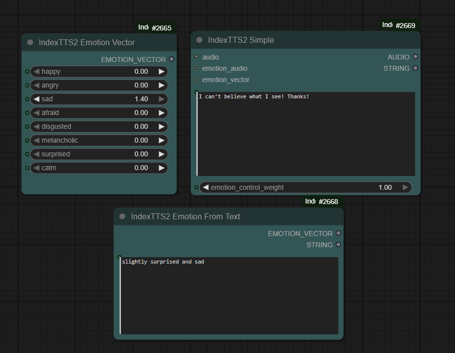

ComfyUI-IndexTTS2
=================

Lightweight ComfyUI wrapper for IndexTTS 2 (voice cloning + emotion control). The nodes call the original IndexTTS2 inference and keep behavior faithful to the repo.

Original repo: https://github.com/index-tts/index-tts

Install
- Copy this folder to: ComfyUI/custom_nodes/ComfyUI-IndexTTS2
- In your ComfyUI Python environment: pip install -r requirements.txt
- Recommended: install PyTorch with CUDA for GPU inference.

Models (checkpoints)
- Download ALL files and subfolders from Hugging Face and put them under this extension's checkpoints/ folder, preserving the original structure:
  https://huggingface.co/IndexTeam/IndexTTS-2/tree/main
- Example layout:
  ```
  ComfyUI/custom_nodes/ComfyUI-IndexTTS2/
    nodes/
    checkpoints/
      config.yaml
      gpt.pth
      s2mel.pth
      bpe.model
      feat1.pt
      feat2.pt
      wav2vec2bert_stats.pt
      qwen0.6bemo4-merge/   (required only for the Text -> Emotion node)
  ```

Nodes
- IndexTTS2 Simple
  - Inputs: audio (speaker), text, emotion_control_weight (0.0-1.0), emotion_audio (optional), emotion_vector (optional)
  - Outputs: AUDIO (for Preview/Save), STRING (emotion source message)

  - Notes: device auto-detected, FP16 on CUDA, 200 ms pause between segments (fixed), emotion precedence = vector > second audio > original audio

- IndexTTS2 Emotion Vector
  - 8 sliders (0.0-1.4) for: happy, angry, sad, afraid, disgusted, melancholic, surprised, calm
  - Constraint: sum of sliders must be <= 1.5 (no auto-scaling)
  - Output: EMOTION_VECTOR

- IndexTTS2 Emotion From Text (optional)
  - Input: short descriptive text
  - Requires: modelscope and local QwenEmotion at checkpoints/qwen0.6bemo4-merge/
  - Outputs: EMOTION_VECTOR, STRING summary

Examples
- Basic: Load Audio -> IndexTTS2 Simple -> Preview/Save Audio
- Second audio emotion: Load Audio (speaker) + Load Audio (emotion) -> IndexTTS2 Simple -> Save
- Vector emotion: IndexTTS2 Emotion Vector -> IndexTTS2 Simple -> Save
- Text emotion: IndexTTS2 Emotion From Text -> IndexTTS2 Simple -> Save

Screenshot


Troubleshooting
- Emotion vector sum exceeds maximum 1.5: lower one or more sliders or adjust the text-derived vector.
- BigVGAN kernel message: custom CUDA kernel is disabled by default; falls back to PyTorch ops.
